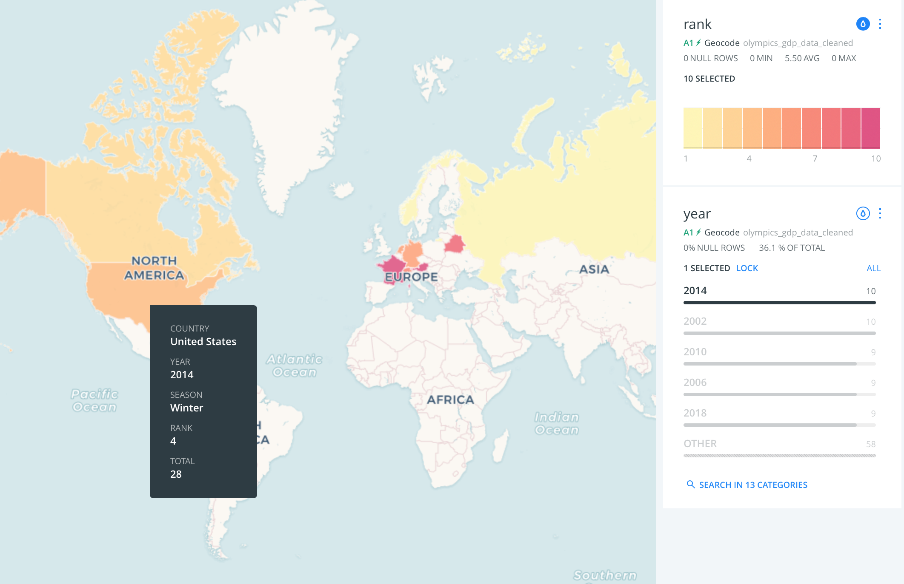

# The Olympics: A Birdseye View of The Olympics (1994 – 2018)

## Deployed webpage:
https://olympicsproject.herokuapp.com/

## Theme: The Olympics!

Goals:
- Shed a  different light on the Olympics data 
- Assess the results by Winter versus Summer Olympics since 1994
- Investigate if GDP is a factor in country ranking
- Integration of news coverage, popularity, and viewership

## Methodology
Data Sources:
- Bi-annual Olympics top 10 countries & Medals: Wikipedia
- GDP data: Wikipedia
- Viewership: 
    - NBC 
    - S&P Global Markets
    - Youtube API
- News coverage
    - New York Times
    - The Guardian
    - Google trends

Data Analytics & Visualization Tools:
- VBA, Pandas
- Python API, Web scraping
- Advanced Data Storage
- Mapping, Matplotlib, 
- Html, CSS, JavaScript, Plotly, Flask
- Github, Heroku deployment

Steps: 
- Data
    - Identification
    - Extraction
    - Management
- Analytics
    - Analysis
    - Visualization
- Dissemination
    - Webpage design
    - Github repo
    - Heroku deployment

